# Comet Provisioning Module for WHMCS  

## Requirements 

* Comet Server v18.9.2+
* WHMCS v7.6.0+
* PHP v5.6.0+

Earlier versions of these products may work with some caveats, but are untested.

## Installation and Configuration

1. Extract the module .zip file
2. Upload the module folder to your WHMCS provisioning module folder, and rename it to __cometbackup__.
    - e.g. __your_whmcs_root_folder__ / __modules__ / __servers__ / __cometbackup__
3. Navigate to __Setup__ > __Products/Services__ > __Servers__ and click __Add New Server__.
4. Choose a name, and input your Comet server's connection details (including port, but not protocol) in the __hostname__ field.  
    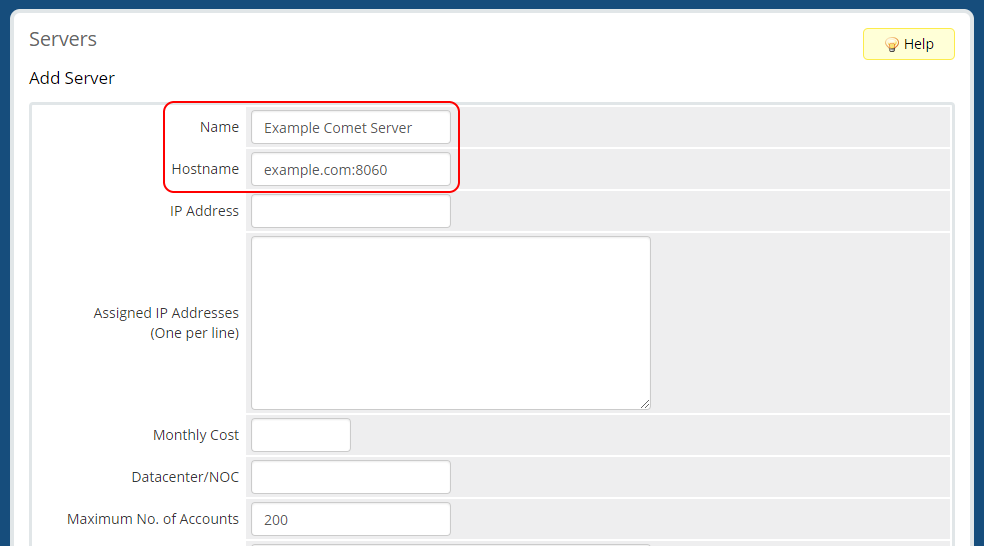
5. Select __Comet Backup__ as the server's __Type__, enter your login details, choose your connection protocol (http/https) and click __Save__.  
    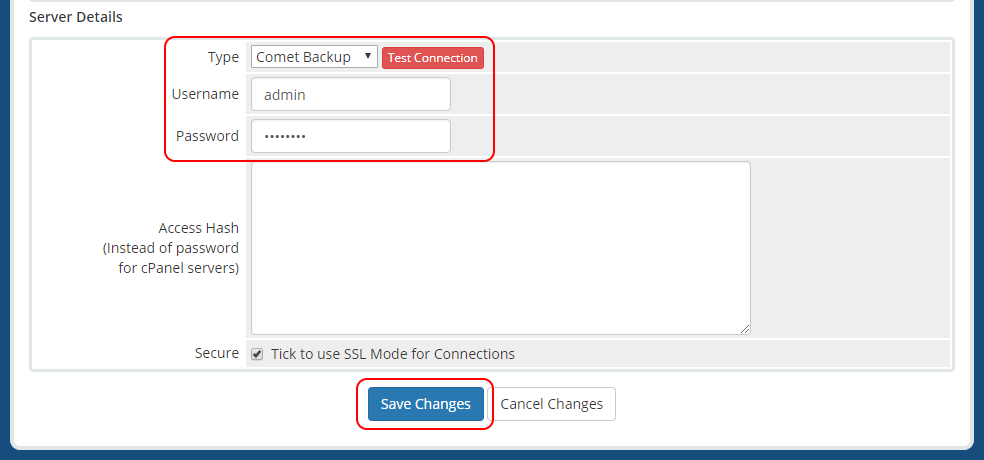
    * You can use the __Test Connection__ button to confirm whether your server is accessible using the provided address and credentials.
6. While still in the __Servers__ area, click __Create New Group__ and assign your server to your new server group.  
    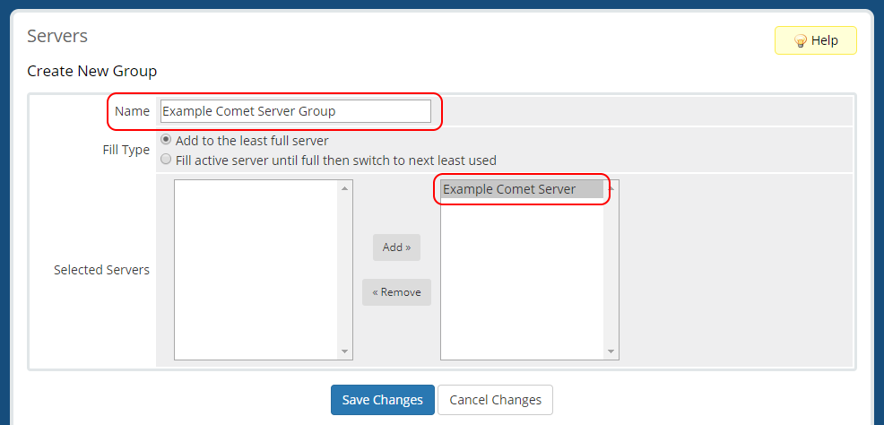
    * We _strongly_ recommend that you only have one server per Comet server group in WHMCS - having more than one server in a group may result in unexpected behaviour.
7. Navigate to __Setup__ > __Products/Services__ > __Products/Services__.
8. Create a product group if none exists.  
    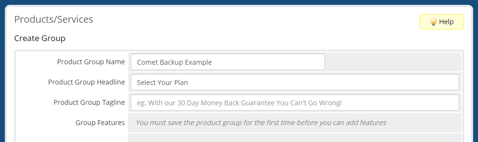
9. Create a new product, assigned to your product group.  
    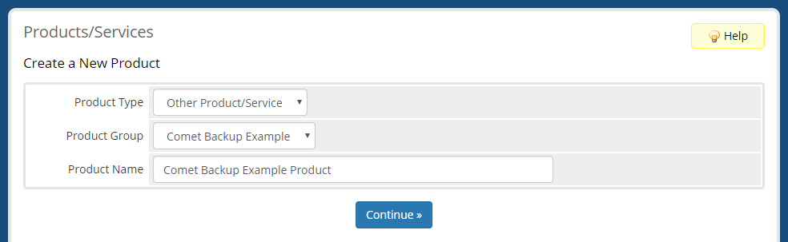
10. In the product's __Details__ tab, we recommend _disabling_ the __Require Domain__ option.  
    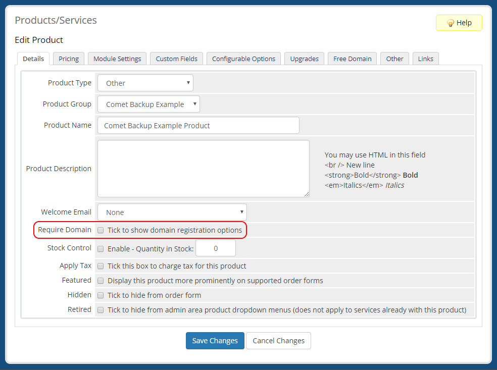 
11. In the product's __Module Settings__ tab, select __Comet Backup__ and choose the new server group.  
    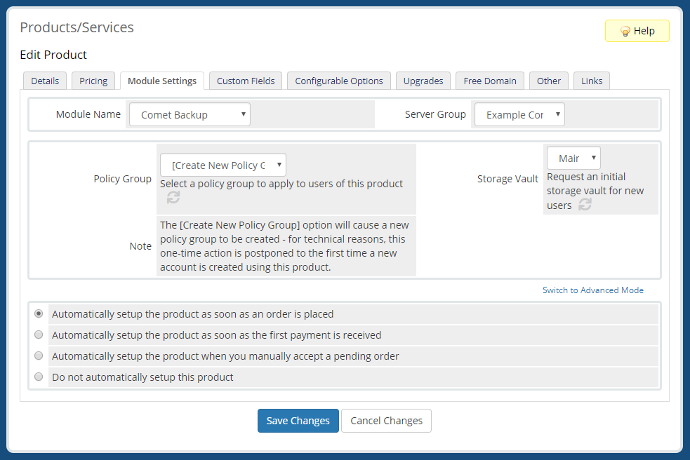
    * If you wish for new orders to be automatically accepted and new accounts to be immediately created on the Comet server, you should select __Automatically setup the product as soon as an order is placed__ in the __Module Settings__ tab   
12. Select a policy group and storage vault if desired, and save your changes.
    * If the __[Create New Policy Group]..__ option is selected, this will cause a new policy group to be created and assigned on the Comet server with the following options:
        * Storage vault creation / editing / deletion disallowed
            * This helps to ensure that users cannot avoid storage vault quotas assigned via WHMCS.
            * Available storage vault types are restricted to the Comet server type, preventing reassignment of an existing vault to a different type.
        * Password changes via the client software are disallowed and admins are allowed to reset user passwords.
            * This requires users to manage their passwords via WHMCS, keeping the WHMCS password on file in sync with the actual password on the Comet server.
    * New policy groups will be created the first time the module attempts to assign them to a new account.  
13. This product can now be used to provision and manage Comet accounts from WHMCS.

***

## Setting up Configurable Options
Configurable options are presented to your users during sign-up. The Comet provisioning module for WHMCS currently supports configurable options for maximum device limits, protected item quotas, and storage vault quotas.

1. Navigate to __Setup__ > __Products/Services__ > __Configurable Options__ and click __Create a New Group__.
2. Pick a sensible group name, select your new product in the __Assigned Products__ list, then click __Save__.  
    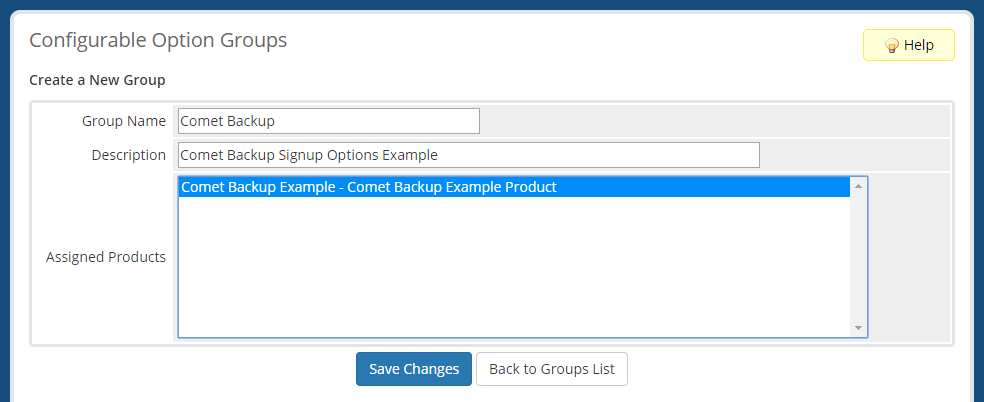
3. Click __Add New Configurable Option__.
4. Enter an __Option Name__. You must choose from the following list, with the left-side preceding "|" being an exact match, and the right side being the label your customers will see when ordering a product:
    * `number_of_devices|Devices`
    * `protected_item_quota_gb|Protected Items Quota (GB)`
    * `storage_vault_quota_gb|Initial Storage Vault Quota (GB)`
5. Set __Option Type__ to __Quantity__.
6. In __Add Option__, enter `GB` or `Devices` depending on the option you're configuring.
7. Click __Save Changes__.  
    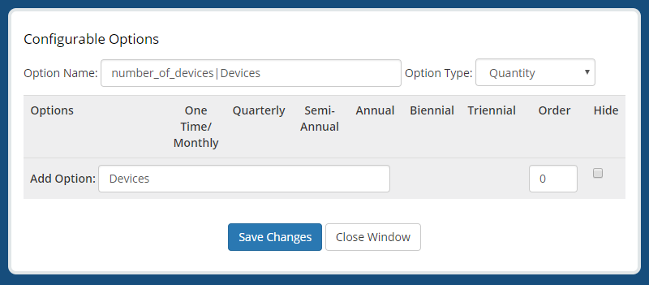
8. Enter desired values for minimum and maximum quantities in __Minimum Quantity Required__ and __Maximum Allowed__ respectively.
    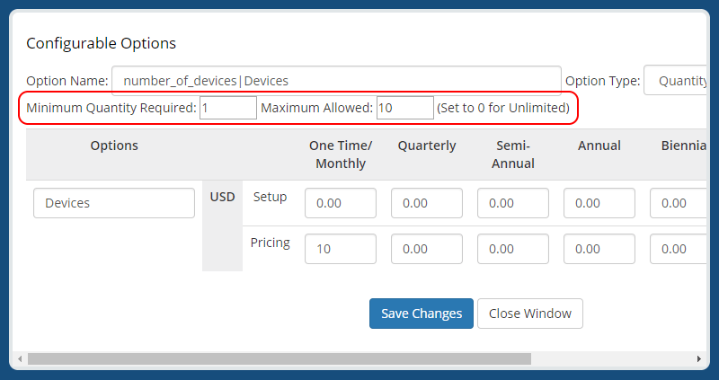
    * If this is intended to be a hidden option, simply set both quantities to your desired value. The __hidden__ status can be set at the group level.
9. Enter desired per-unit pricing.
    * _Note:_ __Payment Type__ should be set to a corresponding setting in the __Pricing__ tab of your product's configuration area in order for this pricing to be utilised.
    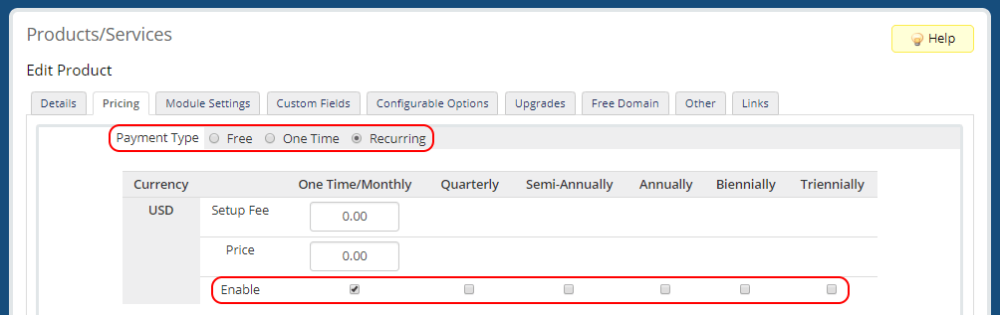
10. Click __Save Changes__ again, then __Close Window__.  
11. Repeat steps __3__ to __10__ again for additional desired restrictions as per step __4__.

***

## Customer Usage
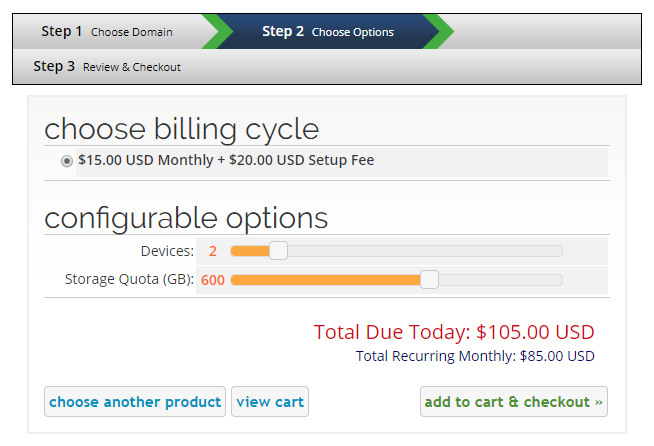 
*Selecting new service options for Comet* 

1. Choose your Comet product from cart.php (e.g. __http://your_whmcs_url.com/cart.php__).
2. Options will present based on the __Configurable Options__ that you have assigned to the product.
3. Complete order.
4. Depending on the product configuration as per step __11__ of __Installation and Configuration__, the module __create__ command may run.

***

## Admin Area Usage
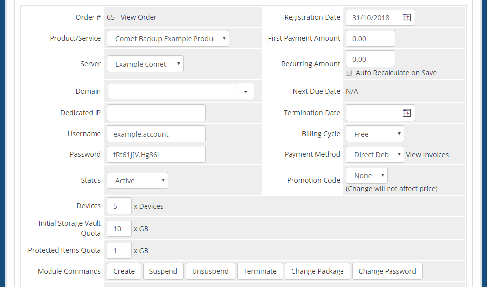  
*Viewing client service options from the admin area*
### Changing Passwords
1. Set the new user password in the customer's __Products/Services__ tab.
2. Save your changes.
3. Run the __Change Password__ action from the module commands area.
### Changing Quotas
1. Set the new protected item / storage vault / device quota values in the customer's __Products/Services__ tab.
2. Save your changes.
3. Run the __Change Package__ action from the module commands area.
### Other Actions
All other module commands can be run directly from a customer's __Products/Services__ tab without the need to perform additional steps such as saving first.