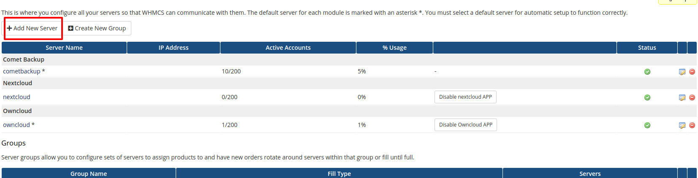
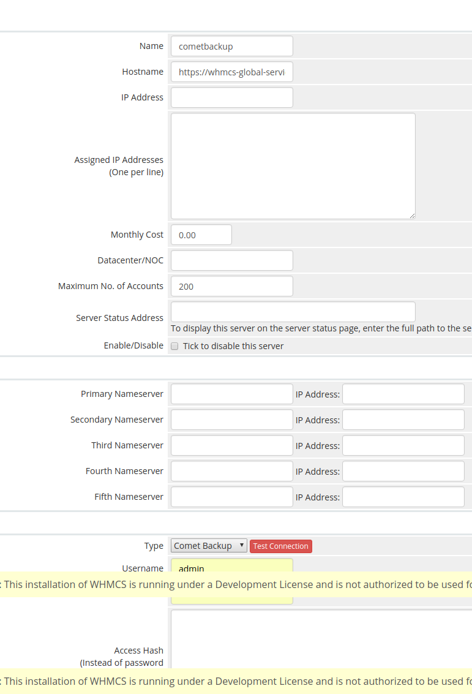
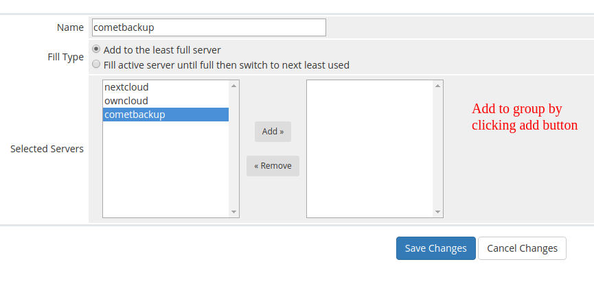
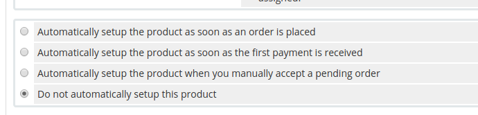
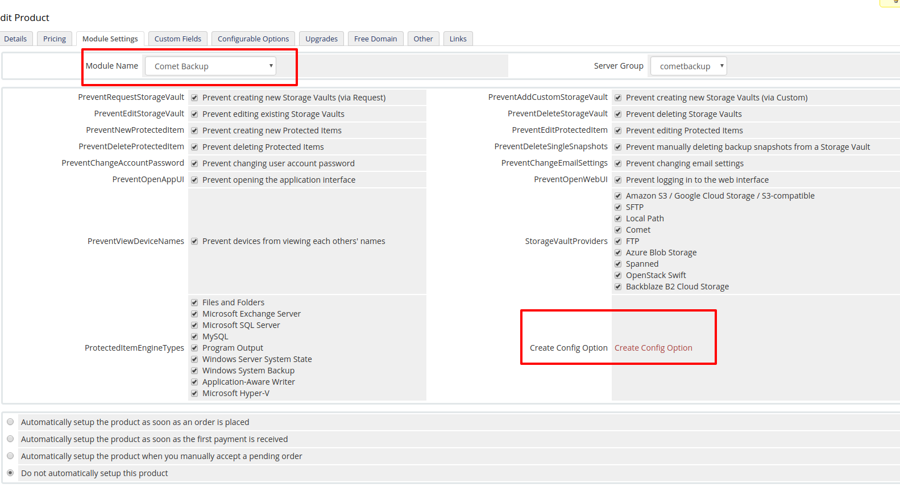

# Comet WHMCS Module Documentation - **2018/10/05**
## Installation and Configuration
1. Extract zip file
2. Upload module file to your WHMCS provisioning module folder.
    - ie whmcs_root_folder/modules/servers/
3. Add server: Navigate to __Setup__ > __Products/Services__ > __Server__ and click __Add New Server__.

4. Add server: Input your server's configuration details and save.

5. Add server: Click __Create New Group__ and assign your server to the new server group.

6. Navigate to __Setup__ > __Products/Services__ > __Products/Services__ and edit or create a new product. In the __Module Settings__ tab, select __Comet Backup__ and choose the new server group.
    * We recommend disabling the __Require Domain__ option in the __Details__ tab.
    * If you wish for new orders to be automatically accepted and new accounts to be immediately created on the Comet server, you should select __Automatically setup the product as soon as an order is placed__ in the __Module Settings__ tab 
    
7. Select a policy group and save your changes.
8. Next click on __Create Config Option__. Configurable options will be created automatically and assigned to the product. These should be edited to reflect desired pricing.

***
## Manual Setup for Configurable Options
1. Navigate to __Setup__ > __Products/Services__ > __Configurable Options__ and click __Create a New Group__.
2. Pick a sensible group name and assign your new product, then click __Save__.
3. Click __Add New Configurable Option__.
4. Enter an __Option Name__. You must choose from the following list, with the left-side preceding "|" being an exact match, and the right side being the label your client will see:
    * `number_of_devices|Devices`
    * `space_in_gb|Protected Items Quota`
5. Set __Option Type__ to __Quantity__.
6. In __Add Option__, enter `GB`.
7. Click __Save Changes__.
8. Enter desired values for minimum and maximum quantities in __Minimum Quantity Required__ and __Maximum Allowed__ respectively.
9. Enter desired per-unit pricing.
10. Click __Save Changes__ again, then __Close Window__.
11. Repeat steps __3__ to __9__ again for additional desired restrictions as per step __4__.
***
## Usage
1. Choose any one product from cart.php (e.g. __http://your_whmcs_url.com/cart.php__).
2. Complete order.
3. Depending on product configuration, the module __create__ command may run.